<div align="center">

# Minimap

The ARPG where you only see the minimap

[![Live][badge-site]][url-site]
[![HTML5][badge-html]][url-html]
[![CSS3][badge-css]][url-css]
[![JavaScript][badge-js]][url-js]
[![Claude Code][badge-claude]][url-claude]
[![License][badge-license]](LICENSE)

[badge-site]:    https://img.shields.io/badge/live_site-0063e5?style=for-the-badge&logo=googlechrome&logoColor=white
[badge-html]:    https://img.shields.io/badge/HTML5-E34F26?style=for-the-badge&logo=html5&logoColor=white
[badge-css]:     https://img.shields.io/badge/CSS3-1572B6?style=for-the-badge&logo=css3&logoColor=white
[badge-js]:      https://img.shields.io/badge/JavaScript-F7DF1E?style=for-the-badge&logo=javascript&logoColor=black
[badge-claude]:  https://img.shields.io/badge/Claude_Code-CC785C?style=for-the-badge&logo=anthropic&logoColor=white
[badge-license]: https://img.shields.io/badge/license-MIT-404040?style=for-the-badge

[url-site]:   https://minimap.neorgon.com/
[url-html]:   #
[url-css]:    #
[url-js]:     #
[url-claude]: https://claude.ai/code

</div>

---

## Overview

Minimap is a loving parody of a certain ARPG's most honest UI element. The whole game happens on the minimap: you are the yellow cross with the big red dot, the world is a pale outline that draws itself in as you explore, and the actual game behind it is a blurred smear you will never see clearly. You start at level 80. Leveling to 100 is the point.

Pick a druid, archer, or mage, walk into procedurally generated dungeons across five biomes, melt rarity-colored dots, dodge boss telegraph circles, and unlock your way across a 24-node atlas. Deaths cost 10% of your level XP, exactly like you remember.

**Live:** minimap.neorgon.com

---

## Features

- **Minimap-only rendering** -- fog-of-war wall outlines, waypoint diamonds, and enemy dots over a blurred biome backdrop
- **Procedural maps** -- seeded biome-shaped generation: cellular caves, swamp causeways over impassable water, forest clearings, angular ruins, crypt mazes; layouts reroll every run
- **Three classes, three skills each** -- Druid (burst + vine zones), Archer (pierce, overcharge, charged shot), Mage (nova, surge, comet) on Q / E / R
- **Click or keys** -- BFS pathfinding for click-to-move, WASD and arrows for manual steering
- **Bodies matter** -- enemies block your path; dodge roll (Space) dashes through with i-frames, sprint (Shift) is fast but one hit while sprinting stuns you
- **Rarity dots** -- white normal, blue magic, yellow rare, orange boss, with fast / tanky / deadly modifiers
- **Boss fights** -- health bar with a parody name, telegraphed AoE circles, adds at 66% and 33%
- **Atlas of Worms** -- a painted world map of 22 nodes; each class climbs from its own starting point toward one shared summit, clearing bosses to open the routes
- **Waypoints** -- totems (green entry, blue midpoint); touch to unlock, press T to teleport, leaving asks first
- **The grind** -- level 80 to 100 on a steepening XP curve, with a 10% XP death penalty and an over-leveling XP falloff
- **Character creator** -- class, sex, height, build, and hair options with a silhouette placeholder, plus a skip button
- **Local roster** -- multiple characters with independent atlas progress, saved in your browser

---

## Running locally

ES modules require a server (opening `index.html` directly will not work):

```bash
make serve   # http://localhost:8854
```

Or from the monorepo root: `make serve P=minimap-site`.

---

## Architecture



```
minimap-site/
├── index.html            # App shell: screens, canvases, HUD overlay, SEO head
├── css/
│   ├── style.css         # Tokens + chargen, roster, atlas, and game HUD styles
│   ├── neorgon-header.css# Vendored Neorgon Header Kit
│   └── neorgon-themes.css
├── js/
│   ├── app.js            # Entry point: load save, bind events, route
│   ├── state.js          # Roster, XP curve, combat stats, atlas progress, localStorage
│   ├── defs.js           # Classes, body options, biomes, rarities, atlas graph
│   ├── utils.js          # Seeded RNG, math helpers, screen switching, toasts
│   ├── mapgen.js         # Map assembly, guarantees, BFS pathfinding
│   ├── shapes.js         # Biome silhouette carvers + decor scatter
│   ├── atlasart.js       # Painterly terrain canvas behind the Atlas
│   ├── game.js           # Engine: rAF loop, movement, roll/sprint, combat, death, waypoints
│   ├── skills.js         # Q/E/R casting, buffs, vine zones, comet impacts
│   ├── boss.js           # Boss activation, telegraphed slams, add waves
│   ├── render.js         # Canvas: fog-of-war lines, dots, VFX, blurred backdrop
│   ├── hud.js            # DOM overlay: orbs, XP bar, tracker, boss bar, panels
│   ├── hub.js            # Atlas screen (SVG node map)
│   ├── chargen.js        # Character creation + roster rendering
│   ├── events.js         # All input: mouse, keyboard, buttons, modals
│   └── neorgon-header.js # Vendored Neorgon Header Kit
└── docs/
    ├── GAME-DESIGN.md    # Numbers, tables, and systems reference
    ├── ASSETS.md         # Next steps: portrait art, biome art, UI ornaments
    └── architecture.mmd/.svg   # This diagram
```

State lives in `localStorage` under the key `minimap-v1`. Map runs are ephemeral: leaving a map discards the layout, PoE-portal style.

---

<div align="center">
<sub>Part of <a href="https://neorgon.com/">Neorgon</a></sub>
</div>
